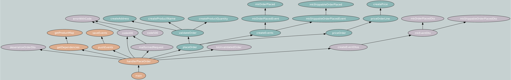

**WIP**

# Star Trek Action Figures Inc.

This repo was put together for an informal talk about strongly typed functional programming. 

I'm using [Haskell, _an advanced, purely functional programming language_](https://www.haskell.org/) as an elegant vehicle for communication of ideas. Unsurprisingly, it has the advantage that its syntax is particularly well suited for functional programming. __This is _not_ intended as a Haskell tutorial__ and many language details are simply brushed under the carpet, so to speak.

A couple of disclaimers:

1. I assume the reader has been introduced to programming and functional programming in particular. I try to explain concepts as I go along, but there is a _lot_ of implicit knowledge here.
2. I have no intentions of being original here. I'll do my best to attribute credit where it's due.

## Trying the app

This app is a very simple web service with only one route: POST /order. It accepts an order of Star Trek action figures, and runs a `PlaceOrder` workflow that checks the validity of the order and publishes events for other hypothetical services to consume.


Try running the server and make a request with this payload (see [here](#running-the-app) how to run the server):

```json
{
  "customerId": 1,
  "orderLines": [
    {
      "productName": "Picard",
      "quantity": 3
    }
  ],
  "shippingAddress": "Earth"
}
```

For the different characters available, you can check the file `/db/products.txt`.

A successful request will be answered with the events created, for demonstration purposes.

## Functional Programming

### Why functional programming

The allure of FP, to me, is threefold:

1. __expressiveness__: it tries to __separate the meaning of a program from its implementation__. When this is achieved, the implementation can be optimized (be it at application or compiler level, for example) to different realities (e.g, parallelism) without changing the meaning of the program. Take the `map` function: "apply a function `f` to every value in a data structure `d`, leaving the structure intact" expresses meaning, but says nothing about _how_ to do it or what's the structure of `d` (is it a list, a tree or something else? If a list, should we do it from left-to-right, all-at-the-same-time or any other way?).
2. __tackles complexity through modularity__: given by laziness and function composition in general and more specifically by higher-order functions, modularity allows building big programs out of smaller ones, reusing and modifying components with a high degree of freedom. John Hughes makes a stronger case than I ever will in his paper [Why Functional Programming Matters](https://www.cs.kent.ac.uk/people/staff/dat/miranda/whyfp90.pdf).
3. __correctness__: this can be controversial, but I always feel software correctness is at the heart of most discussions around FP (in particularly in Haskell and other languages gravitating around it) in a way I just don't see in other ecosystems. Be it via testing, FP introduced [property-based testing](https://begriffs.com/posts/2017-01-14-design-use-quickcheck.html), or via _correctness-by-construction_: Haskell's type-system is one of the most rich of industry-grade languages and has been like that since its beginning, and new languages like [Agda](https://agda.readthedocs.io/en/latest/getting-started/what-is-agda.html) are breaking new ground with regards to type-safety. Also, see the discussion around [effect systems (and maybe discover a new language)](https://www.unison-lang.org/docs/fundamentals/abilities/).

The discussion around programming styles is surely an old one. I always suggest reading John Backus' 1977 Turing Award Lecture [_Can Programming Be Liberated from the von Neumann Style?_](https://dl.acm.org/doi/pdf/10.1145/359576.359579) for putting modern languages in perspective.

### Functions all the way down
> Programming as if functions truly matter. (Scott Wlaschin, author of _Domain Modeling Made Functional_)



The picture above is a call graph of our web service. Call graphs are a very useful tool to assess the architecture of an application as it lets us see how we are composing our functions.

We can distinguish three categories of objects in the call graph above:
- in blue (or is it green?), we have the functions pertaining to the `PlaceOrder` workflow. These are all pure functions combined into the `placeOrder` function. This function sequences `validateOrder`, `priceOrder` and `createEvents`, piping through them the incoming `order` request.  
- in light pink, we have some peripheric functions, such as DTO or HTTP error response constructors. These are not part of our core logic, but work at the edges of our domain. All of them are pure functions.
- finally, in orange, we perform IO to fetch dependencies, generate random ids, save events, and return an HTTP response back, among other things. 

There are two very important things to note here:
1. __just a small, outer part of our application actually performs IO__. Importantly, all our domain logic is pure.
2. __IO is insidious__. `pushEvents` is colored in orange, but the call to the DB is done in `saveEvents`. Any region of our call graph depending on impure code is itself impure: if `saveEvents` is impure, so are `pushEvents`, `handlePlaceOrder` and `main`. 


### Defining functions

Let's start by analysing a simple function:

```haskell
add :: Int -> Int -> Int
add x y = x + y
```

There are several things in the function definition above that may surprise you, if you're not used to it. Let's take it apart:

```haskell
add :: Int -> Int -> Int
```

The above is a type definition. We can think of `add` as a function which takes 2 arguments of type `Int` and returns a value of the same type.

In reality that is not quite true... __In Haskell, all functions take only _1 argument___. That's because Haskell is based on [lambda calculus](https://serokell.io/blog/untyped-lambda-calculus). Let me show you an equivalent type definition:

```haskell
add :: Int -> (Int -> Int)
```

`add` is actually a function (or a lambda abstraction) that goes from `Int` to _another_ function `Int -> Int`. Because of right-side associativity, there is no need for the parenthesis in this case, though sometimes they are useful to convey intent.

Let's now focus on the value definition of the `add` function:

```haskell
add x y = x + y
```

Above, we're saying: `add` takes arguments `x` and `y` and returns `x + y`.

But... how come?! We've just said that `add` only takes 1 argument! That's because we're being (very conveniently) tricked by a sugary layer of the syntactic kind. Let's _desugar_ it:

```haskell
add = \x -> \y -> x + y
```

In Haskell, [all functions are considered curried](https://wiki.haskell.org/Currying), and both definitions above are equivalent. `\x -> y` is the syntax for what is sometimes called an _anonymous_ function. The `\` slash stands for a `λ`. Equivalent code in Javascript, with similar syntax, for comparison:

```js
// javascript
const add = x => y => x + y
```

By the way, there is no need in Haskell for qualifiers such as `const`: __all values are immutable__.

#### Function Application

In a functional language, function application is the most common operation. It makes sense to unclutter it, so application is defined with a `space`:

```haskell
result = add 9 3 -- 12
```


##### Partial application

And remember what we said about curried functions:

```haskell
add :: Int -> Int -> Int
add x y = x + y

add9 :: Int -> Int
add9 = add 9

result :: Int
result = add9 3 -- 12
```

Because we define functions as having the arguments that better express our intent (`add` takes arguments `x` and `y`), but they're secretly curried, the pattern of _partial_ application arises. This is very useful for dependency injection, for example:

```haskell
-- priceOrder is built to be used in a pipeline which transforms Orders
priceOrder :: ProductMap -> ValidatedOrder -> Either Text PricedOrder

-- ProductMap is a dependency, 'injected' by partial application
priceOrderWithProductMap :: ValidatedOrder -> Either Text PricedOrder
priceOrderWithProductMap = priceOrder productMap
-- ^ is now ready to be included in a pipeline through which orders flow
```

### Function composition

TODO

#### Simple composition

TODO

#### Effectful composition

TODO

#### Chaining IO actions

Let's go back to the [call graph](#functions-all-the-way-down) for our web service. The orange ovals is where IO is being performed. Those seem like functions, but they're really not: they're __Actions__. Haskell is _purely functional_, meaning, all functions are pure. So, if those were functions, someone would be lying here, and we don't want that. IO actions are computed by pure functions and all you can do with an action is producing a new action from its output, or, if its output is of no interest, just sequencing it with another action!

#### `do` notation

TODO

### Algebraic Data Types (ADTs)

When building programs, we very often need to build data with some structure. Haskell let's us express structured, composable data with __Algebraic Data Types__. As we can see next, this powerful feature allows the developer to build big types out of small ones, like Lego, combining them at will in order to declare sofisticated domains.

We can see types as sets of values with a certain structure. We usually say a value _inhabits_ a given type if it belongs to the set of values of that type. For instance, the type `Bool` is inhabited by 2 values: `True` and `False`. We say the size of `Bool` is 2. The type `String` is inhabited by all possible sequences of characters, the type `Int32` by all signed integers representable with 32 bits, and so on.

Haskell's type system is a __nominal type system__. All values are originally produced by some __data constructor__, which determines their type. This is in contrast with, for example, the typing system used by Typescript where two values are of the same type if their structure (e.g, the entries of an object) is the same.

A __nominal__ system is in some ways less flexible than a __structural__ one, but brings better type-safety by preventing accidental type equivalence.

__Data constructors__ are functions which return a value that inhabits the type they belong to. The 'mark' of the data constructor remains with the value throughout its life and gives rise to a very convenient idiom called __pattern matching__, which we'll see in a moment.

The building blocks of Algebraic Data Types are __Sums__ and __Products__.

#### Sums

##### Bool

`Bool` is a sum type and `True` and `False` are its data constructors. In this case, `True` and `False` take no arguments, and are thus called _nullary_ constructors. Any given value of type `Bool` can _either_ be `True` or `False`, not both!

```haskell
data Bool = True | False
```

##### Maybe

`Maybe a` is also a sum type. It is used to express the possibility of something not existing. For instance, if we want to parse a string to obtain an integer, we need to account for the possibility that the parsing can fail. This could be expressed by a function that returns a `Maybe Int`. 

```haskell
data Maybe a = Nothing | Just a
```

The `a` in `Maybe a` is a __type variable__, also known sometimes as a __generic__. `Just` is a (unary) data constructor that takes a value of type `a` and returns a value of type `Maybe a`. Some of the values inhabiting `Maybe Int` are the following: `Nothing`, `Just (-2345)`, `Just 0`, `Just 1`, `Just 42`, etc. Some values _not_ inhabiting `Maybe Int` are: `Just "foo"`, `Just True`, `Just 3.14159`. These last ones are not acceptable because we are _fixing_ the type variable `a` (in `Maybe a`) to be an `Int`.

The size of `Maybe Int` is the _sum_ of all `Int`s (in `Just Int` ) plus 1 (for `Nothing`). 

##### Either

`Either a b` is another sum type. 

```haskell
data Either a b = Left a | Right b
```

Following the same logic above, its size is the _sum_ of all possible `a`s and all possible `b`s.

`Either a b` can be used to express a computation that can have one of two types of outcome. If we want to tokenize a string of code, for example, it may be interesting to _either_ return, say, a list of tokens or an error message signalling at which character the parsing failed. This could be achieved with `Either Error (List Token)`, where `Error` could be an alias for `String`.

#### Products

##### Tuple

A tuple is the canonical product type:

```haskell
data (,) a b = (,) a b
```

It can be a bit hard to see it immediately, so let's define an equivalent type:

```haskell
data Tuple a b = MkTuple a b
```

A `Tuple` is a type with only one data constructor `MkTuple`. As always, this data constructor is a function. In this case, one which, given two arguments of type `a` and `b`, returns a value which inhabits the type `Tuple a b`.

Tuples are often used when we have heterogenous data that we want to package together. We may want to package arguments to a function that outputs a formatted string with the name and age of a person: `Tuple Name Age`, or simply `(Name, Age)` if we choose to use the canonical `(,)` type. 

Naturally, we are free to produce our own product types. Also note that their data constructor can have as many parameters as we wish:

```haskell
-- these are simple type aliases and are mainly 
-- used to make our code more expressive
type Name = String
type Age = Int
type PlaceOfBirth = String

data Person = Person Name Age PlaceOfBirth
--   ^ type   ^ data constructor
-- types and data constructors live in different namespaces and can be named the same  
```

We can have as many `Person` values as the possible combinations of `Name`, `Age` and `PlaceOfBirth`. Thus, the size of the type `Person` can be calculated as the _product_ of the sizes of the arguments to its data constructor. Put simply: size of `Person` = (size of `Name`) * (size of `Age`) * (size of `PlaceOfBirth`).

##### Records

In Haskell, __records__ are not first class citizens. This has been a somewhat contentious topic, but some recent developments have made operating with records more ergonomic, although we won't go into detail here.

In Haskell, a __record__ is just a product type with some syntactic sugar to allow named fields:

```haskell
data Person = Person {
    name         :: Name,
    age          :: Age,
    placeOfBirth :: PlaceOfBirth
}
```

This type is the same type we declared before. Only now we can access the fields of a `Person` value by name. `name`, `age` and `placeOfBirth` are functions that, when applied to a `Person`, return the respective field.

The `::` symbol translates to "_of type_". `name :: Name` reads "_name of type Name_".

#### Composing Types

Now that we have Sums and Products we can create more complex types by combining them!

```haskell
data Role = Admin | Level0 | Level1

data Email = UnvalidatedEmail String | ValidatedEmail String

data User = User {
    name  :: String,
    role  :: Role
    email :: Email
}
```

#### Recursive Types

Some data structures are recursive in the sense that its parts can have the same structure as the whole. A list is a good example. Another would be trees.

```haskell
data List a = Nil | Cons a (List a)

myList :: List Int -- myList has type List Int
myList = Cons 3 (Cons 2 (Cons 1 Nil))

data Tree a = Leaf a | Branch (Tree a) (Tree a)

myTree :: Tree String -- myTree has type Tree String
myTree = Branch (Leaf "A") (Branch (Leaf "B") (Leaf "C"))
```

#### Pattern Matching

As said before, every value carries a "birth mark", the mark of the data constructor that produced it. As long as the data constructor is in scope (just a detail for now, but something we will come back to), we can unpack a value, match on its constructor and extract the arguments that were once fed to it.

```haskell
data Maybe a = Nothing | Just a

maybeIntToString :: Maybe Int -> String
maybeIntToString mx = 
  case mx of
    Nothing -> "Nothing to see here!"
    Just x  -> "The number is " <> show x

stringX = maybeIntToString Nothing -- "Nothing to see here!"    
stringY = maybeIntToString (Just 42) -- "The number is 42"    
```

## Domain Modeling with FP

TODO

## Further reading

TODO

## Running the app

### Docker
There is a Dockerfile included that can be used to build a Docker image and run the app containerized. 

This is a good option if you don't have and don't want the Haskell toolchain installed in your machine. The Dockerfile leverages caching so you should be able to experiment with the source code without having to compile the whole application each time.

The following command will build the image and run the container. The app will be listening for requests on port 3000.

`$ docker build . -t star-trek-haskell && docker run -t -p 3000:3000 star-trek-haskell`

Remember to re-run the above command everytime you change the source code.

### Cabal
Run `cabal run`. This should (re)compile the application and run it immediately after.

#### GHCUp - Haskell toolchain
For most systems, the easiest way to install the Haskell toolchain is by installing [GHCUp](https://www.haskell.org/ghcup/).

Once that is done, use it to install [Cabal](https://www.haskell.org/cabal/), the Haskell build and package system.
